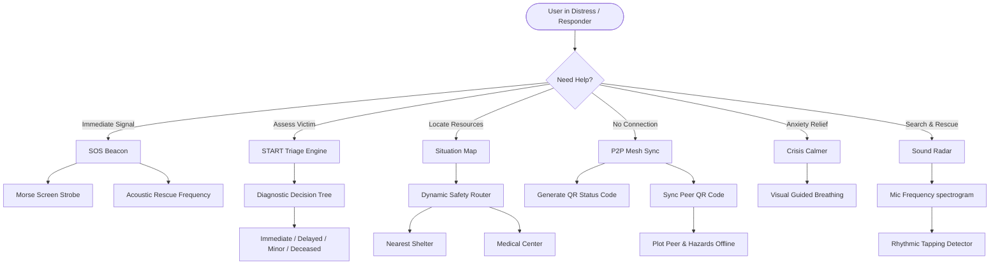

# LifeBridge AI - Emergency Response & Disaster Assistance

LifeBridge AI is an **"Agent for Good"** Progressive Web App (PWA) designed to support citizens, medical responders, and search-and-rescue teams during extreme disasters (floods, cyclones, accidents) and critical medical emergencies. 

In a real crisis, standard communications (cellular, internet) are frequently lost. LifeBridge AI is designed with an **offline-first PWA architecture**, keeping critical maps, AI routing, diagnostics, and beacons operational entirely locally.

---

## Key Features & Visual Workflow



### 1. P2P Offline Mesh Sync (Collaborative Hazard Mapping)
- **Local Reports**: Users can tap anywhere on the map to mark obstacles (e.g. fallen power lines, deep floods).
- **QR Matrix Syncing**: All local hazard coordinates, battery levels, and status metrics are packed into a compressed offline string and displayed as a PWA QR Code.
- **Mesh Import**: Rescuers can scan this QR code (or paste the code string) to instantly import and plot their peers' coordinates and hazard reports on their own offline maps, propagating safety data peer-to-peer.

### 2. START Triage Diagnostic Engine
- **START Protocol**: Employs the military-standard *Simple Triage and Rapid Treatment* workflow.
- **Diagnostic Flow**: Guides responders through questions regarding breathing rate, pulse, and command checks.
- **Triage Priority**: Classifies patients into **Immediate (Red)**, **Delayed (Yellow)**, **Minor (Green)**, or **Deceased (Black)**, auto-logging the details and showing tailored emergency medical steps.

### 3. Rescue Sound Radar
- **Mic Signal Analyzer**: Uses the browser's Web Audio API (`AnalyserNode`) to capture ambient sounds.
- **Visual Waveform**: Draws a real-time signal spectrogram showing ambient sound frequencies.
- **Periodic Peak Detection**: Evaluates sound patterns to detect rhythmic taps (e.g., three rhythmic knocks, representing standard distress signaling) and logs alerts in the situation center.

### 4. SOS Beacon & Distress Oscillator
- **Morse Strobe**: Flashes the screen in visual Morse Code SOS (`... --- ...`).
- **Acoustic frequency**: Generates a high-pitched `950Hz` oscillator tone (via Web Audio) to help search dogs or rescue squads pinpoint the user under dense debris.

### 5. Extreme Power Budgeter
- **Battery-Saver Mode**: Switchable monochrome layout that stops heavy leaflet renders, pauses animations, and lowers screen energy footprints.
- **Automation**: Triggers automatically if the device battery drops below 20%.

---

## Technical Stack & Dependencies

- **Structure**: Semantic HTML5 (incorporating 100% offline inline SVGs).
- **Style**: Custom CSS3 design system (Midnight palette, glassmorphism card blur, battery-saver styles).
- **Logic**: Vanilla ES Modules (Modular JS).
- **Mapping**: Leaflet.js (Tiles cached via Service Worker, with offline vector grid fallbacks).
- **Offline PWA**: Service Worker (`sw.js`) and Web Manifest (`manifest.json`).
- **QR Generation**: Canvas-based QRious JS.

---

## Local Setup & Hosting

Since this is a fully client-side Progressive Web App (PWA), you can run it using any simple local web server:

1. Clone or copy the files into a local folder:
   ```bash
   git clone <repository-url>
   cd lifebridge-ai
   ```
2. Start a local server:
   - **Using Python (Recommended)**:
     ```bash
     python -m http.server 8000
     ```
   - **Using Node.js**:
     ```bash
     npx http-server -p 8000
     ```
3. Open your browser and navigate to:
   ```
   http://localhost:8000
   ```

---

## PWA Offline Verification
To test the offline functionality:
1. Open the Developer Tools (F12) in your browser.
2. Go to the **Application** tab, select **Service Workers**, and check **Offline**.
3. Reload the page. All controls, styling, guides, custom maps, and synthesized audio oscillators will continue to operate fully without an internet connection.
